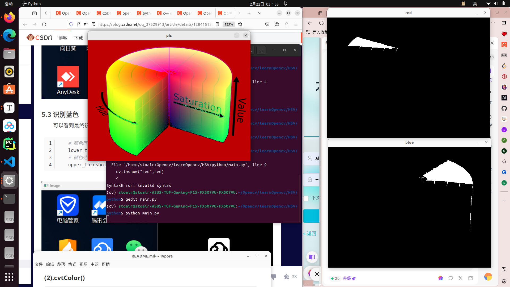

problem：

- **pip install -i https://pypi.tuna.tsinghua.edu.cn/simple matplotlib**

- 
- g++ -g main.cpp `pkg-config --cflags opencv4` -o final `pkg-config --libs opencv4
- 

# Opencv

## 一、读取图片

### (1).imshow

```c++
Mat imread(const string& filename, intflags=1 );

flags:
enum
{
/* 8bit, color or not */
   CV_LOAD_IMAGE_UNCHANGED  =-1,
/* 8bit, gray */
   CV_LOAD_IMAGE_GRAYSCALE  =0,
/* ?, color */
   CV_LOAD_IMAGE_COLOR      =1,
/* any depth, ? */
   CV_LOAD_IMAGE_ANYDEPTH   =2,
/* ?, any color */
   CV_LOAD_IMAGE_ANYCOLOR   =4
};

Mat image0=imread("dota.jpg",CV_LOAD_IMAGE_ANYDEPTH | CV_LOAD_IMAGE_ANYCOLOR);//载入最真实的图像
Mat image1=imread("dota.jpg",0);//载入灰度图
Mat image2=imread("dota.jpg",199);//载入3通道的彩色图像
Mat logo=imread("dota_logo.jpg");//载入3通道的彩色图像
```

- CV_LOAD_IMAGE_UNCHANGED，这个标识在新版本中被废置了，忽略。
- CV_LOAD_IMAGE_ANYDEPTH- 如果取这个标识的话，若载入的图像的深度为16位或者32位，就返回对应深度的图像，否则，就转换为8位图像再返回。
- CV_LOAD_IMAGE_COLOR- 如果取这个标识的话，总是转换图像到彩色一体
- CV_LOAD_IMAGE_GRAYSCALE- 如果取这个标识的话，始终将图像转换成灰度

****

- flags >0返回一个3通道的彩色图像。
- flags =0返回灰度图像。
- flags <0返回包含Alpha通道的加载的图像。

### (2).namedWindow

```c++
void namedWindow(const string& winname,int flags=WINDOW_AUTOSIZE ); 
```

 - WINDOW_NORMAL设置了这个值，用户便可以改变窗口的大小（没有限制）
  - WINDOW_AUTOSIZE如果设置了这个值，窗口大小会自动调整以适应所显示的图像，并且不能手动改变窗口大小。
  - WINDOW_OPENGL 如果设置了这个值的话，窗口创建的时候便会支持OpenGL。

### (3).imshow

```c++
void imshow(const string& winname, InputArray mat);
```

### (4).效果图

c++


python


## 二、像素操作

### (1).访问像素

#### 1. at()

```c++
image.at<uchar>(j,i)= value;  //单通道
image.at<cv::Vec3b>(j,i)[channel]= value;  //三通道
image.at<cv::Vec3b>(j,i) = cv::Vec3b(a,b,c);
```

#### 2.Mat_

```c
cv::Mat_<uchar> image(image1);
image(20,30) = value;
```

### (2).遍历像素

#### 1.指针遍历

```c++
uchar *data = image.ptr<uchar>(i);  //ptr()返回行的地址
```

```c++
for (int i = 0; i < height; i++) {
    cv::Vec3b* row = image.ptr<cv::Vec3b>(i);
    for (int j = 0; j < width; j++) {
        cv::Vec3b& pixel = row[j];//Vec3b&直接操作图像中的像素值，而不需要创建新的对象
        std::cout << "Pixel at (" << i << "," << j << "): "
                  << "B=" << (int)pixel[0] << " "
                  << "G=" << (int)pixel[1] << " "
                  << "R=" << (int)pixel[2] << std::endl;
    }
}
```

#### 2.迭代器遍历

```c++
cv::MatIterator_ <cv::Vec3b> it;
或者
cv::Mat_<cv::Vec3b>::iterator it;
```

```c++
cv::MatIterator_<cv::Vec3b> it, end;
for (it = image.begin<cv::Vec3b>(), end = image.end<cv::Vec3b>(); it != end; ++it) {
    
    cv::Vec3b& pixel = *it;
    
    pixel[0] = 255; 
    pixel[1] = 0; 
    pixel[2] = 0; 
}
```

python


c++


### (3).threshold

```c++
double cv::threshold(src, OutputArray, thresh, maxval, type)
```


c++:


python:


### (4).通道分离

#### 1.split

```c++
C++: void split(const Mat& src, Mat*mvbegin);
C++: void split(InputArray m,OutputArrayOfArrays mv);
```

#### 2.merge

```c++
C++: void merge(const Mat* mv, size_tcount, OutputArray dst)
C++: void merge(InputArrayOfArrays mv,OutputArray dst)
```

c++


python


### (5)Gamma矫正

Gamma校正是对输入图像灰度值进行的非线性操作，使输出图像灰度值与输入图像灰度值呈指数关系。Gamma`矫正用于调整图像的亮度和对比度`。Gamma矫正可以改变图像的灰度值分布，使图像在显示时看起来更加自然和逼真。通常情况下，人眼对亮度的感知是非线性的，因此使用Gamma矫正可以更好地模拟人眼的感知特性。
$$
V_{out}=AV_{in}^\gamma
$$
γ的值决定了输入图像和输出图像之间的灰度映射方式，即决定了是增强低灰度值区域还是增高灰度值区域。
γ>1时，图像的高灰度区域对比度得到增强，直观效果是一幅偏亮的图变暗了下来。
γ<1时，图像的低灰度区域对比度得到增强，直观效果是一幅偏暗的图变亮了起来。

python


c++


### (6).深浅拷贝

**浅拷贝是指当图像之间进行赋值**时，图像数据并未发生复制，而是两个对象都指向同一块内存块。 

**深拷贝是指新创建的图像拥有原始图像的崭新拷贝**

c++


python


## 三、基本绘图

### (1).line

```c++
void cv::line(InputOutputArray img,Point pt1, Point pt2, const Scalar & color, int  thickness = 1, int  lineType = LINE_8, int  shift = 0)
```

| img       | Image.                                                       |
| --------- | ------------------------------------------------------------ |
| pt1       | First point of the line segment.                             |
| pt2       | Second point of the line segment.                            |
| color     | Line color.                                                  |
| thickness | Line thickness.                                              |
| lineType  | Type of the line. See [LineTypes](https://docs.opencv.org/4.0.0/d6/d6e/group__imgproc__draw.html#gaf076ef45de481ac96e0ab3dc2c29a777). |
| shift     | Number of fractional bits in the point coordinates.          |

### (2).rectangle

```c++
void cv::rectangle(InputOutputArray img, Point pt1, Point pt2, const Scalar & color, int  thickness = 1,int  lineType = LINE_8, int  shift = 0)
 
void cv::rectangle(InputOutputArray img, Rect rec, const Scalar & color, int  thickness = 1,int  lineType = LINE_8, int  shift = 0)            
```

### (3).circle

```c++
void cv::circle(InputOutputArray img, Point center,  int  radius, const Scalar & color, int  thickness = 1, int  lineType = LINE_8, int  shift = 0)
```

- thickness = -1 为实心圆

python


c++


## 四、图像处理

### (1).颜色空间

#### 1.意义

- RGB 颜色空间利用三个颜色分量的线性组合来表示颜色，任何颜色都与这三个分量有关，而且这三个分量是高度相关的，所以连续变换颜色时并不直观，想对图像的颜色进行调整需要更改这三个分量才行。

- 自然环境下获取的图像容易受自然光照、遮挡和阴影等情况的影响，即对亮度比较敏感。而 RGB 颜色空间的三个分量都与亮度密切相关，即只要亮度改变，三个分量都会随之相应地改变，而没有一种更直观的方式来表达。

- 在图像处理中使用较多的是 HSV 颜色空间，它比 RGB 更接近人们对彩色的感知经验。非常直观地表达颜色的色调、鲜艳程度和明暗程度，方便进行颜色的对比。

H（色调/hue）  |

S（饱和度/saturation）  |

V（明度/Value）  |


#### 2.cvtColor()

```c++
void cv::cvtColor(InputArray src, OutputArray dst, int code, int dstCn=0)
```

- src：输入图像，可以是Mat类型的图像或者其他支持的图像数据结构。
- dst：输出图像，用于存储转换后的图像。
- code：颜色空间转换的代码，例如CV_BGR2GRAY表示将BGR颜色空间转换为灰度图像。
- dstCn：输出图像的通道数，如果为0，则自动根据code参数确定通道数。

#### 3.inRange()

```c++
void inRange(InputArray src, InputArray lowerb,InputArray upperb, OutputArray dst);
void inRange(image, Scalar(hmin,smin,vmin), Scalar(hmax,smax,vmax), image);
//typedef Vec<double, 4> Scalar;
```

python:



c++:


#### 4.适应光线

光线较暗 -> 暗色调 ； 增加饱和度S ；减小亮度V

光线较亮 -> 亮色调 ； 减小饱和度S ；增大亮度V

### (2).形态操作

#### 1.腐蚀

腐蚀的基本概念就像土壤侵蚀一样，只侵蚀前景对象的边界（总是尽量保持前景为白色）。那它有什么作用呢？内核在图像中滑动（如二维卷积）。只有当内核下的所有像素都为 1 时，原始图像中的像素（1 或 0）才会被视为 1，否则会被侵蚀（变为零）。

```c++
C++: void erode(
	InputArray src,
	OutputArray dst,
	InputArray kernel,
	Point anchor=Point(-1,-1),
	int iterations=1,
	int borderType=BORDER_CONSTANT,
	const Scalar& borderValue=morphologyDefaultBorderValue()
 );	
```

```c++
 int g_nStructElementSize = 3; //结构元素(内核矩阵)的尺寸
 
//获取自定义核
Mat element = getStructuringElement(MORPH_RECT,
	Size(2*g_nStructElementSize+1,2*g_nStructElementSize+1),
	Point( g_nStructElementSize, g_nStructElementSize ));
```

#### 2.膨胀

它与腐蚀正好相反。这里，如果内核下至少有一个像素为“1”，则像素元素为“1”。所以它会增加图像中的白色区域，或者增加前景对象的大小。通常情况下，在去除噪音的情况下，腐蚀后会膨胀。因为，腐蚀消除了白噪声，但它也缩小了我们的对象。所以我们扩大它。由于噪音消失了，它们不会再回来，但我们的目标区域会增加到腐蚀之前的状态。它还可用于连接对象的断开部分。

```c++
C++: void dilate(
	InputArray src,
	OutputArray dst,
	InputArray kernel,
	Point anchor=Point(-1,-1),
	int iterations=1,
	int borderType=BORDER_CONSTANT,
	const Scalar& borderValue=morphologyDefaultBorderValue() 
);
```

#### 3.开/闭运算

- 开运算（Opening Operation），其实就是先腐蚀后膨胀的过程。开运算可以用来消除小物体、在纤细点处分离物体、平滑较大物体的边界的同时并不明显改变其面积。

- 先膨胀后腐蚀的过程称为闭运算(Closing Operation)，闭运算能够排除小型黑洞(黑色区域)。

```c++
C++: void morphologyEx(
InputArray src,
OutputArray dst,
int op,
InputArraykernel,
Pointanchor=Point(-1,-1),
intiterations=1,
intborderType=BORDER_CONSTANT,
constScalar& borderValue=morphologyDefaultBorderValue() 
);
```

第三个参数，int类型的op，表示形态学运算的类型，可以是如下之一的标识符：

- MORPH_OPEN – 开运算（Opening operation）
- MORPH_CLOSE – 闭运算（Closing operation）
- MORPH_GRADIENT -形态学梯度（Morphological gradient）
- MORPH_TOPHAT - “顶帽”（“Top hat”）
- MORPH_BLACKHAT - “黑帽”（“Black hat“）
- MORPH_ERODE-"腐蚀"
- MORPH_DILATE-"膨胀"

c++


python


#### 4.error

**problem** : /../lib/libstdc++.so.6: version `GLIBCXX_3.4.30' not found

**solve** : 系统环境下 /usr/lib/x86_64-linux-gnu/libstdc++.so.6 文件含有GLIBCXX_3.4.30版本，而anaconda环境下libstdc++.so.6文件含有的最高版本为GLIBCXX_3.4.29，因此有了前面的报错。

```
rm libstdc++.so 
rm libstdc++.so.6
ln -s /usr/lib/x86_64-linux-gnu/libstdc++.so.6.0.32 libstdc++.so
ln -s /usr/lib/x86_64-linux-gnu/libstdc++.so.6.0.32 libstdc++.so.6
```

### (3).平滑处理

图像的平滑处理是在尽量图像原有信息的情况下，过滤掉图像内部的噪声。由于图像平滑处理的同时通常伴随着图像的模糊操作，有时图像平滑处理也称为图像模糊处理。使用滤波器模板确定的邻域内像素的平均/加权平均灰度值代替图像中每个像素的值。平滑线处理滤波器也称**均值滤波器**

#### 1.均值滤波 

```python
dst = cv2.blur(src, ksize, anchor, borderType)
```

#### 2.方框滤波 

```python
dst = cv2.boxFilter(src, ddepth, ksize, anchor, normalize, borderType)
```

#### 3.高斯滤波 

```python
dst = cv2.GauusianBlur(src, ksize, sigmaX, sigmaY, borderType)
```

#### 4.中值滤波 

```python
dst = cv2.medianBlur(src, ksize)
```

#### 5.双边滤波

边缘滤波保留是一种图像处理技术，旨在在应用滤波器时保留图像中的边缘信息。在图像处理中，滤波器通常用于平滑图像或者增强特定的图像特征，但是滤波器也可能导致边缘信息的模糊或丢失。通过在滤波过程中保留边缘信息，从而在平滑图像的同时保持图像中的边缘清晰度

```c++
dst = cv2.bilateralFilter(src, d, sigmaColor, sigmaSpace, dst, borderType)
```

- d：过滤过程中每个像素邻域的直径范围。如果不是正数，则函数会从参数 sigmaSpace 计算该值；

- sigmaColor：颜色空间过滤器的 sigma 值，参数的值越大，表明该像素邻域内有越宽广的颜色会被混合到一起，产生较大的半等色区域；

- sigmaSpace：坐标空间中滤波器的 sigma 值，如果该值较大，则意味着越远的像素将相互影响，从而使更大的区域中足够相似的颜色获取相同的颜色。当 d>0 时，d 指定了邻域大小且与 sigmaSpace 无关，否则 d 正比于 sigmaSpace。

一般将 sigmaSpace设置大一些，sigmaColor 设置小一些，最终呈现的效果较好。

c++


python


### (4).Ganny边缘检测

#### 1.图像平滑

#### 2.图像梯度

图像梯度可以把图像看成二维离散函数，图像梯度简单来说就是求导，在图像上表现出来的就是提取图像的边缘。对二维函数f(x, y)求偏微分。

Sobel、Scharr 和 Laplacian...算子

#### 3.Ganny原理

1. 高斯滤波，滤除噪声

2. 计算像素点梯度强度和方向

   1. 应用Sobel等算子卷积
   2.  计算梯度值和方向

   $$
   G=\sqrt{G_x^2+G_y^2}\\
   \theta=\arctan(\frac{G_y}{G_x})(\theta \rightarrow 0,45,90,135)
   $$

3. 应用极大值抑制

   A 点位于边缘（垂直方向）。渐变方向与边缘垂直。 B 点和 C 点处于梯度方向。因此，用点 B 和 C 检查点 A，看它是否形成局部最大值。如果是这样，则考虑下一阶段，否则，它被抑制（归零）。

   

4. 双阈值检测，确定边缘

   选择两个阈值（关于阈值的选取方法在扩展中进行讨论），根据高阈值得到一个边缘图像，这样一个图像含有很少的假边缘，但是由于阈值较高，产生的图像边缘可能不闭合，未解决这样一个问题采用了另外一个低阈值。

   在高阈值图像中把边缘链接成轮廓，当到达轮廓的端点时，该算法会在断点的8邻域点中寻找满足低阈值的点，再根据此点收集新的边缘，直到整个图像边缘闭合。

#### 4.Canny()

```c++
C++: void Canny(InputArray image,OutputArray edges, double threshold1, double threshold2, int apertureSize=3,bool L2gradient=false )
```

1. InputArray类型的image，输入图像，即源图像，填Mat类的对象即可，且需为单通道8位图像。
2. OutputArray类型的edges，输出的边缘图，需要和源图片有一样的尺寸和类型。
3. double类型的threshold1，第一个滞后性阈值。
4. double类型的threshold2，第二个滞后性阈值。
5. int类型的apertureSize，表示应用Sobel算子的孔径大小，其有默认值3。
6. bool类型的L2gradient，一个计算图像梯度幅值的标识，有默认值false。

python


C++


### (5).霍夫变换

最基本的霍夫变换是从黑白图像中检测直线(线段)

霍夫变换(Hough Transform)是图像处理中的一种特征提取技术，该过程在一个参数空间中通过计算累计结果的局部最大值得到一个符合该特定形状的集合作为霍夫变换结果。

#### 1.霍夫线变换

##### 1.1 原理

图像空间点——>参数空间线，图像空间点共线——>参数空间线交点， 参数空间点——>图像空间线

##### 1.2 HoughLines()

```c++
void HoughLines(InputArray image, OutputArray lines, double rho, double theta, int threshold, double srn=0, double stn=0 )
```

- 第二个参数 存储线条，每线条由 $ (\rho , \theta) $表示
- 第三个参数  rho  距离精度(步长) $ \rho $
- 第四个参数  theta  角度精度 $ \theta $

#### 2.霍夫圆变换

##### 2.1 原理

$ (x_0-a)^2+(y_0-b)^2=R^2 $

1. 从平面坐标到极坐标转换三个参数 $C(a_0,b_0,r)$  a~0~ ,b~0~是圆心
2. 图像空间点—>参数空间圆锥，图像空间点共圆—>圆锥截面圆交点,  三维空间点—>图像空间圆

##### 2.2 HoughCircles()

**基本原理**

1. 噪声敏感——>中值滤波
2. 基于图像梯度，检测边缘发现可能圆心，从可能圆心计算最佳半径

**霍夫梯度法**：

1. 计算图像中每个像素点的梯度方向和大小。可以使用Sobel算子或其他边缘检测算法来计算梯度。
2. 对于每个像素点，根据其梯度方向和大小，在参数空间中生成可能的直线或圆的参数。对于直线，参数通常是斜率和截距；对于圆，参数通常是圆心坐标和半径。
3. 对于每个生成的参数组合，统计通过该参数组合的像素点数量。这可以通过累加器数组来实现，数组的每个元素对应一个参数组合，值表示通过该参数组合的像素点数量。
4. 根据累加器数组的结果，找到可能存在的直线或圆的参数。可以设置一个阈值来筛选出像素点数量大于阈值的参数组合，即为检测到的直线或圆。
5. 根据检测到的直线或圆的参数，在原始图像上绘制检测结果。

```c++
void HoughCircles(InputArray image,OutputArray circles, int method, double dp, double minDist, double param1=100,double param2=100, int minRadius=0, int maxRadius=0 )
```

- method : CV_HOUGH_GRADIENT
- dp : 如果dp= 1时，累加器和输入图像具有相同的分辨率。如果dp=2，累加器便有输入图像一半那么大的宽度和高度。
- minDist ：为霍夫变换检测到的圆的圆心之间的最小距离

- param1 ：传递给canny边缘检测算子的高阈值
- param2 ：越小，可以检测更多根本不存在的圆；越大，能通过检测的圆更加接近完美的圆形

**connectedComponentsWithStats**()

```c++
int cv::connectedComponentsWithStats(InputArray image,OutputArray labels,OutputArray stats,OutputArray centroids,int connectivity = 8, int ltype = CV_32S );
```

retval : 返回值是连通区域的数量。
labels : labels是一个与image一样大小的矩形（labels.shape = image.shape），其中每一个连通区域会有一个唯一标识，标识从0开始。
stats ：stats会包含5个参数分别为x,y,h,w,s。分别对应每一个连通区域的外接矩形的起始坐标x,y；外接矩形的wide,height；s其实不是外接矩形的面积，实践证明是labels对应的连通区域的像素个数。
centroids : 返回的是连通区域的质心。

c++


python


## 五、轮廓

### (1).查找绘制

**预处理**：

- 灰度化：使用cv::cvtColor()
- 图像去噪：使用高斯滤波cv::Gaussian()
- 二值化：使用cv::Threshold()
- 形态学处理：cv::morphologyEx()

其中灰度化可以将3通道图像转化为单通道图像，以便进行二值化门限分割；去噪可以有效剔除图像中的异常独立噪点；二值化是为轮廓查找函数提供单通道图像；形态学的某些处理通常可以剔除细小轮廓，联通断裂的轮廓。

#### 1.findContours()

```c++
void cv::findContours(InputOutputArray image,OutputArrayOfArrays  contours,OutputArray  hierarchy,int  mode,int method, Point  offset = Point())   
```

- contours : 输出：检测到的轮廓。由若干个cv::Point类型的点组成了单个轮廓std :: vector < cv :: Point >，再由若干个轮廓组成输入图像中的全部轮廓std::vector<std :: vector < cv :: Point >>
- hierarchy : 输出：轮廓级别信息。Hierarchy为可选输出变量，是std::vector< cv::Vec4i>类型的向量（每个元素都是一个4个int值构成的向量）。它具有与轮廓数量一样多的元素。例如，第i个轮廓， hierarchy[i][0]，hierarchy[i][0]，hierarchy[i][2]和hierarchy[i][3]依次为：第i个轮廓的[Next, Previous, First_Child, Parent]，即轮廓i相同等级的下一轮廓、前一轮廓，第一个子轮廓和父轮廓（上一级轮廓）的索引号（即contours向量中的轮廓序号）。如果轮廓i没有下一个，前一个，父级或嵌套轮廓，则层次结构[i]的相应元素将为负数。

#### 2.drawContours() 

```c++
void cv::drawContours(InputOutputArray  image,InputArrayOfArrays  contours,int  contourIdx,const Scalar&color,int  thickness = 1,int  lineType = LINE_8,InputArray   hierarchy = noArray(),int  maxLevel = INT_MAX, Point offset = Point() )       
```

- contouridx : 待绘制轮廓序号

### (2).层级结构

OpenCV中每个轮廓都有自己的信息，关于它是什么层次结构，谁是它的子轮廓，谁是它的父轮廓等.OpenCV将它表示为四个int值的数组，类型为cv::Vec4i（4个int值）：

[Next，Previous，First_Child，Parent]

`hierarchy`数组在OpenCV中是一个四维数组，hierarchy`数组的四维结构为 `[轮廓索引, 轮廓信息, 关系信息]


- Next

Next表示同一级别的下一个轮廓索引。例如，在我们的图片中取出轮廓-0。同一水平的下一个轮廓是轮廓-1。 所以简单地说Next = 1。类似地，对于轮廓-1，next是轮廓-2。 所以Next = 2。
轮廓-2的同一级别没有下一个轮廓，所以轮廓-2的Next = -1。轮廓-4呢？它与轮廓-5处于同一水平。所以它的下一个轮廓是轮廓-5，所以轮廓-4的Next = 5。

- Previous


Previous表示同一级别的上一个轮廓索引。例如，轮廓-1的上一个轮廓在同一级别中为轮廓-0。 类似地，对于轮廓-2，它的上一个轮廓是轮廓-1。而对于轮廓-0，没有先前的，所以把它的Previous = -1。

- First_Child


First_Child表示当前轮廓的第一个子轮廓索引。例如，对于轮廓-2，子轮廓是轮廓-2a。因此轮廓-2的First_Child为轮廓-2a的相应索引值。轮廓-3a呢？它有两个子轮廓。但hierarchy参数只记录第一个子轮廓，因此它是轮廓-4的索引值。因此，对于轮廓-3a，First_Child = 4。

- Parent

Parent表示当前轮廓的父轮廓索引。对于轮廓-4和轮廓-5，它们的父轮廓都是轮廓-3a。对于轮廓-3a，它的父轮廓是轮廓-3，依此类推。

### (3).筛选轮廓

首次查找轮廓有许多中间有空洞的轮廓不符合要求，下面就通过遍历每一个轮廓的hierarchy级别参数的第3第4个参数来找到那些有子轮廓或者有父轮廓的轮廓，并删除之。注意向量迭代器的使用，删除后会返回下一个向量的指针；此外，contours与hierarchy元素需要同步删除和并递增迭代器，以保持编号对应关系，否则会删错。

```c++
std::vector<std::vector<cv::Point>>::iterator itc = contours.begin();
std::vector<cv::Vec4i>::iterator itc_hierarchy = hierarchy.begin();
int i = 0;
while(itc_hierarchy != hierarchy.end())
{
    if (hierarchy[i][2] > 0 || hierarchy[i][3] > 0)
    {
        itc = contours.erase(itc);
        itc_hierarchy = hierarchy.erase(itc_hierarchy);
    }
    else
    {
        ++i;
        ++itc;
        ++itc_hierarchy;
    }
}
```

### (4).凸包

凸包外观看起来与轮廓逼近相似，但并非如此(在某些情况下两者可能提供相同的结果)。一般而言，凸曲线是始终凸出或至少平坦的曲线。如果在内部凸出，则称为凸度缺陷。例如，检查下面的手的图像。红线显示手的凸包。双向箭头标记显示凸度缺陷，这是船体与轮廓线之间的局部最大偏差。


```c++
void cv::convexHull	(InputArray points,OutputArray 	hull,bool 	clockwise = false,bool 	returnPoints = true )	
```

- clockwise：方向标记。如果为True，则输出凸包为顺时针方向。否则，其方向为逆时针方向。
- returnPoints：默认情况下为True。然后返回船体点的坐标。如果为False，则返回与船体点相对应的轮廓点的索引。

python


c++


## 六、Functions

### (1).createTrackbar()

```c++
C++: int createTrackbar(conststring& trackbarname, conststring& winname,int* value, int count, TrackbarCallback onChange=0,void* userdata=0);
```

第一个参数，const string&类型的trackbarname，表示轨迹条的名字
第二个参数，const string&类型的winname，窗口的名字
第三个参数，int* 类型的value，一个指向整型的指针，表示滑块的位置。并且在创建时，滑块的初始位置就是该变量当前的值。
第四个参数，int类型的count，表示滑块可以达到的最大位置的值。滑块最小的位置的值始终为0。
第五个参数，TrackbarCallback类型的onChange，默认值0。这是一个指向回调函数的指针，每次滑块位置改变时，这个函数都会进行回调。并且这个函数的原型必须为void XXXX(int,void*);其中第一个参数是轨迹条的位置，第二个参数是用户数据（看下面的第六个参数）。如果回调是NULL指针，表示没有回调函数的调用，仅第三个参数value有变化。
第六个参数，void*类型的userdata，他也有默认值0。这个参数是用户传给回调函数的数据，用来处理轨迹条事件。如果使用的第三个参数value实参是全局变量的话，完全可以不去管这个userdata参数。

c++


python


### (2).SetMouseCallback() 

```c++
 void setMousecallback(const string& winname, MouseCallback onMouse, void* userdata=0)
  //  winname:窗口的名字
  //  onMouse:鼠标响应函数，回调函数。指定窗口里每次鼠标时间发生的时候，被调用的函数指针。
```

```c++
void on_Mouse(int event, int x, int y, int flags, void* param);
  //  event是 CV_EVENT_*变量之一
  //  x和y是鼠标指针在图像坐标系的坐标（不是窗口坐标系） 
  //  flags是CV_EVENT_FLAG的组合， param是用户定义的传递到setMouseCallback函数调用的参数。
```

**event 具体说明如下：**

- EVENT_MOUSEMOVE 0 //滑动

- EVENT_LBUTTONDOWN 1 //左键点击

- EVENT_RBUTTONDOWN 2 //右键点击

- EVENT_MBUTTONDOWN 3 //中键点击

- EVENT_LBUTTONUP 4 //左键放开

- EVENT_RBUTTONUP 5 //右键放开

- EVENT_MBUTTONUP 6 //中键放开

- EVENT_LBUTTONDBLCLK 7 //左键双击

- EVENT_RBUTTONDBLCLK 8 //右键双击

- EVENT_MBUTTONDBLCLK 9 //中键双击

**flags 具体说明如下：**

- EVENT_FLAG_LBUTTON 1 //左键拖曳
- EVENT_FLAG_RBUTTON 2 //右键拖曳
- EVENT_FLAG_MBUTTON 4 //中键拖曳
- EVENT_FLAG_CTRLKEY 8 //(8~15)按 Ctrl 不放

- EVENT_FLAG_SHIFTKEY 16 //(16~31)按 Shift 不放

- EVENT_FLAG_ALTKEY 32 //(32~39)按 Alt 不放

python


c++


