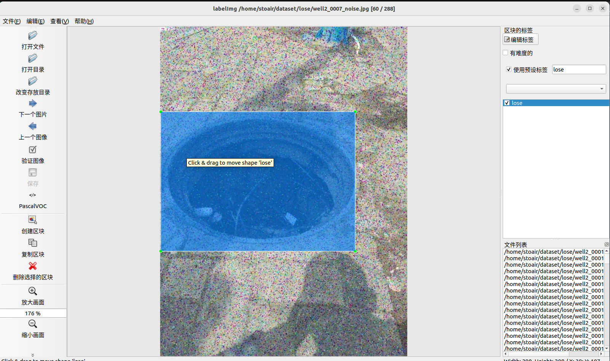

# Deep Learning


## Basic

- 神经网络：


- 监督学习：1个x对应1个y；

- Sigmoid : 激活函数
  $$
  sigmoid=\frac{1}{1+e^{-x}}
  $$

- ReLU : 线性整流函数；


## Logistic Regression

-->binary classification / x-->y 0 1

### some sign

$$
(x,y) , x\in{\mathbb{R}^{n_{x}}},y\in{0,1}\\\\
M=m_{train}\quad m_{test}=test\\\\
M:{(x^{(1)},y^{(1)}),(x^{(2)},y^{(2)})...,(x^{(m)},y^{(m)})}\\\\
X =
\left[ 
\begin{matrix} 
x^{(1)} & x^{(2)} &\cdots & x^{(m)} 
\end{matrix} \right] \leftarrow n^{x}\times m\\\\
\hat{y}=P(y=1\mid x)\quad\hat{y}=\sigma(w^tx+b)\qquad
w\in \mathbb{R}^{n_x} \quad b\in \mathbb{R}\\
\sigma (z)=\frac{1}{1+e^{-z}}
$$

### Loss function

单个样本
$$
Loss\:function:\mathcal{L}(\hat{y},y)=\frac{1}{2}(\hat{y}-y)^2\\\\
p(y\mid x)=\hat{y}^y(1-\hat y)^{(1-y)}\\
min\;cost\rightarrow max\;\log(y\mid x)\\
\mathcal{L}(\hat{y},y)=-(y\log(\hat{y})+(1-y)\log(1-\hat{y}))\\\\
y=1:\mathcal{L}(\hat{y},y)=-\log\hat{y}\quad \log\hat{y}\leftarrow larger\quad\hat{y}\leftarrow larger\\
y=0:\mathcal{L}(\hat{y},y)=-\log(1-\hat{y})\quad \log(1-\hat{y})\leftarrow larger\quad\hat{y}\leftarrow smaller\\\\
$$

### cost function 

$$
\mathcal{J}(w,b)=\frac{1}{m}\sum_{i=1}^{m}\mathcal{L}(\hat{y}^{(i)},y^{(i)})
$$

### Gradient Descent

find w,b that minimiaze J(w,b) ;

Repeat:
$$
w:=w-\alpha \frac{\partial\mathcal{J}(w,b)}{\partial w}(dw)\\
b:=b-\alpha \frac{\partial\mathcal{J}(w,b)}{\partial b}(db)
$$

### Computation Grapha

example:
$$
J=3(a+bc)
$$


one example gradient descent computer grapha:

recap:
$$
z=w^Tx+b\\
\hat{y}=a=\sigma(z)=\frac{1}{1+e^{-z}} \\
\mathcal{L}(a,y)=-(y\log(a)+(1-y)\log(1-a))
$$
The grapha:

$$
'da'=\frac{d\mathcal{L}(a,y)}{da}=-\frac{y}{a}+\frac{1-y}{1-a}\\
'dz'=\frac{d\mathcal{L}(a,y)}{dz}=\frac{d\mathcal{L}}{da}\cdot\frac{da}{dz}=a-y\\
'dw_1'=x_1\cdot dz\;\;\; ...
\\w_1:=w_1-\alpha dw_1\;\;...
$$
m example gradient descent computer grapha:

recap:
$$
\mathcal{J}(w,b)=\frac{1}{m}\sum_{i=1}^m\mathcal{L}(a^{(i)},y^{(1)})
$$
The grapha: (two iterate)
$$
\frac{\partial}{\partial w_1}\mathcal{J}(w,b)=\frac{1}{m}\sum_{i=1}^m\frac{\partial}{\partial w_1}\mathcal{L}(a^{(i)},y^{(1)})\\\\
For \quad i=1 \quad to \quad m:\{\\
a^{(i)}=\sigma (w^Tx^{(i)}+b)\\
\mathcal{J}+=-[y^{(i)}\log a^{i}+(1-y^{(i)}\log(1-a^{(i)}))]
\\
dz^{(i)}=a^{(i)}-y^{(i)}\\
dw_1+=x_1^{(i)}dz^{(i)}\\
dw_2+=x_2^{(i)}dz^{(i)}\\
db+=dz^{(i)}\}\\
\mathcal{J}/=m;dw_1/=m;dw_2/=m;db/=m\\
dw_1=\frac{\partial\mathcal{J}}{\partial w_1}\\
w_1=w_1-\alpha dw_1
$$

## Vectorization

### vectorized

$$
z=np.dot(w,x)+b
$$
logistic regression  derivatives:

change:
$$
dw_1=0,dw_2=0\rightarrow dw=np.zeros((n_x,1))\\
\begin{cases}dw_1+=x_1^{(i)}dz^{(i)}\\
dw_2+=x_2^{(i)}dz^{(i)}\end{cases}\rightarrow dw+=x^{(i)}dz^{(i)}\\\\
Z=\left(\;\begin{matrix}
z^{(1)} & z^{(2)} &... &z^{(m)}\end{matrix}\;\right)=w^TX+b\\
A=\sigma(Z)\\\\
dz=A-Y=\left(\;\begin{matrix}
a^{(1)}-y^{(1)} & z^{(2)}-y^{(2)} &... &z^{(m)}-y^{(m)}\end{matrix}\;\right)\\
db=\frac{1}{m}\sum_{i=1}^mdz^{(i)}=\frac{1}{m}np.sum(dz)\\
dw=\frac{1}{m}Xdz^T=\frac{1}{m}\left(\;\begin{matrix}
x^{(1)}\cdot dz^{(1)}&x^{(2)}\cdot dz^{(2)}&...&x^{(m)}\cdot dz^{(m)}\end{matrix}\;\right)
$$
### Implementing:

$$
Z=w^TX+b=np.dot(w^T,X)+b\\
A=\sigma(Z)\\
J=-\frac{1}{m}\sum_{i=1}^m(y^{(i)}\log(a^{(i)})+(1-y^{(i)})\log(1-a^{(i)}))\\
dZ=A-Y\\
dw=\frac{1}{m}XdZ^T\\
db=\frac{1}{m}np.sum(dZ)\\
w:=w-\alpha dw\\
b:=b-\alpha db
$$
### broadcasting

$$
np.dot(w^T,X)+b
$$
A note on numpy
$$
a=np.random.randn(5) //wrong\rightarrow a=a.reshape(5,1)\\
assert(a.shape==(5,1))\\
a=np.random.randn(5,1)\rightarrow colum\;vector
$$
## Shallow Neural Network

### Representation

2 layer NN:
$$
Input\;layer\rightarrow hidden\rightarrow layer\rightarrow out\;layer\\
a^{[0]}\rightarrow a^{[1]}\rightarrow a^{[2]}\\\\
z^{[1]}=W^{[1]}a^{[0]}+b^{[1]}\\
a^{[1]}=\sigma(z^{[1]})\\
z^{[2]}=W^{[2]}a^{[1]}+b^{[2]}\\
a^{[2]}=\sigma(z^{[2]})=\hat y\\
$$
### computing:

$$
z_i^{[1]}=w_i^{[1]T}x+b_i^{[1]}\\
a_i^{[1]}=\sigma(z_i^{[1]})\\
\left[ 
\begin{matrix} 
w_1^{[1]T}\\w_2^{[1]T}\\w_3^{[1]T}\\w_4^{[1]T} 
\end{matrix} \right] \cdot \left[ 
\begin{matrix} 
x_1\\x_2\\x_3 
\end{matrix} \right]+\left[ 
\begin{matrix} 
b_1^{[1]}\\b_2^{[1]}\\b_3^{[1]}\\b_4^{[1]} 
\end{matrix} \right]=\left[ 
\begin{matrix} 
z_1^{[1]}\\z_2^{[1]}\\z_3^{[1]}\\z_4^{[1]} 
\end{matrix} \right]
$$

### Vectorize:

$$
x^{(i)}\rightarrow a^{[2](i)}=\hat y^{(i)}\\
Z^{[1]}=W^{[1]}X+b^{[1]}\\
A^{[1]}=\sigma(Z^{[1]})\\
Z^{[2]}=W^{[2]}A^{[1]}+b^{[2]}\\
A^{[2]}=\sigma(Z^{[2]})\\
W^{[1]}\cdot \left[ 
\begin{matrix} 
x^{(1)} & x^{(2)} &\cdots & x^{(m)} 
\end{matrix} \right]+b=\left[ 
\begin{matrix} 
z^{[1](1)} & z^{[1](2)} &\cdots & z^{[1](m)} 
\end{matrix} \right]=Z^{[1]}
$$

### Activation functions

$$
a=\frac{1}{1+e^{-z}},a'=a(1-a)\\
a=\tanh(z)=\frac{e^z-e^{-z}}{e^z+e^{-z}},a\in (-1,1),a'=1-a^2\\
a=max(0,z)\\
a=max(0.01z,z)
$$

### Gradient descent

#### computation


$$
z^{[1]}=W^{[1]}x+b^{[1]}\rightarrow\\
a^{[1]}=\sigma(z^{[1]})\rightarrow\\
z^{[2]}=W^{[2]}a^{[1]}+b^{[2]}\rightarrow\\
a^{[2]}=\sigma(z^{[2]})\rightarrow\\
\mathcal{L}(a^{[2]},y)\\\\
dz^{[2]}=a^{[2]}-y\\
dw^{[2]}=dz^{[2]}a^{[1]T}\\
db^{[2]}=dz^{[2]}\\
dz^{[1]}=w^{[2]T}dz^{[2]}*a^{'[1]}\\
dw^{[1]}=dz^{[1]}\cdot x^T\\
db^{[1]}=dz^{[1]}\\\\
$$

dz^[1]^的推导涉及到了矩阵求导

#### the dimension

$$
x:(n_0,m)\quad W^{[1]}:(n_1,n_0)\rightarrow \\
a^{[1]}:(n_1,m)\quad W^{[2]:}:(n_2,n_1)\rightarrow\\
a^{[2]}:(n_2,m)\quad
$$

#### vectorize

$$
dZ^{[2]}=A^{[2]}-Y\\
dW^{[2]}=\frac{1}{m}dZ^{[2]}A^{[1]T}\\
db^{[2]}=np.sum(dZ^{[2]},axis = 1,keepdims=True)\\
dZ^{[1]}=W^{[2]T}dZ^{[2]}*A^{'[1]}\\
dW^{[1]}=\frac{1}{m}dZ^{[1]}X^T\\
db^{[1]}=\frac{1}{m}np.sum(dZ{[1]},axis=1,keepdims=True)
$$

### Random Initialization

$$
w^{[1]}=np.random.randn((2,2))*0.01\\
b^{[1]}=np.zero((2,1))
$$

## Deep neural network

### notation

$$
example:L\;\;layer\;\;NN\\
a^{[l]}\rightarrow activation\;function\\
w^{[l]}\rightarrow weights\;for\;z^{[l]}\\
\hat y=a^{[L]}
$$

### Forward propagation

$$
for\;\;l=1,2,3..\\
z^{[l]}=w^{[l]}a^{[l-1]}+b^{[l]}\\cache\;z^{[l]},w^{[l]},b^{[l]}
\\
a^{[l]}=g^{[l]}(z^{[l]})
$$

### Backward propagation

$$
da^{[l]}\rightarrow da^{[l-1]}(dz^{[l]},dw^{[l]},db^{[l]})\\
dz^{[l]}=da^{[l]}*g^{[l]'}(z^{[l]})=w^{[l+1]}dz^{[l+1]}*g^{[l]'}(z^{[l]})\\
dw^{[l]}=dz^{[l]}\cdot a^{[l-1]T}\\
db^{[l]}=dz^{[l]}\\
da^{[l-1]}=w^{[l]T}\cdot dz^{[l]}\\
$$

### matrix dimensions

$$
dw,w^{[l]}:(n^{[l]},n^{[l-1]})\\
db, b^{[l]}:(n^{[l]},1 )\\
Z^{[l]},A^{[l]}:(n^{[l]},m)
$$

# Improve NN

## train/dev/test set

0.7/0/0.3     0.6.0.2.0.2    ->   100-10000

0.98/0.01/0.01 ...   ->   big data

## Bias/Variance

偏差度量的是单个模型的学习能力，而方差度量的是同一个模型在不同数据集上的稳定性。

<center class ='img'>

</center>


high variance ->high dev set error

high bias ->high train set error

## basic recipe

high bias ->  bigger network  /  train longer  /  more advanced optimization algorithms  /  NN architectures

high variance -> more data  /  regularization /  NN architecture

## Regularization

### Logistic Regression

$$
L2\;\; regularization:\\min\mathcal{J}(w,b)\rightarrow J(w,b)=\frac{1}{m}\sum_{i=1}^m\mathcal{L}(\hat y^{(i)},y^{(i)})+\frac{\lambda}{2m}\Vert w\Vert_2^2
$$

### Neural network

$$
Frobenius\;\; norm\\
\Vert w^{[l]}\Vert^2_F=\sum_{i=1}^{n^{[l]}}\sum_{j=1}^{n^{[l-1]}}(w_{i,j}^{[l]})^2\\\\
Dropout\;\; regularization:\\
d3=np.randm.rand(a3.shape.shape[0],a3.shape[1]<keep.prob)\\
a3=np.multiply(a3,d3)\\
a3/=keep.prob
$$

### other ways

- early stopping
- data augmentation

## Optimization problem

speed up the training of your neural network 

### Normalizing inputs

1. subtract mean

$$
\mu =\frac{1}{m}\sum _{i=1}^{m}x^{(i)}\\
x:=x-\mu
$$

2. normalize variance

$$
\sigma ^2=\frac{1}{m}\sum_{i=1}^m(x^{(i)})^2\\
x/=\sigma
$$

### vanishing/exploding gradients

$$
y=w^{[l]}w^{[l-1]}...w^{[2]}w^{[1]}x\\
w^{[l]}>I\rightarrow (w^{[l]})^L\rightarrow\infty
\\w^{[l]}<I\rightarrow (w^{[l]})^L\rightarrow0
$$

### weight initialize

$$
var(w)=\frac{1}{n^{(l-1)}}\\
w^{[l]}=np.random.randn(shape)*np.sqrt(\frac{1}{n^{(l-1)}})
$$

### gradient check

#### Numerical approximation

$$
f(\theta)=\theta^3\\
f'(\theta)=\frac{f(\theta+\varepsilon)-f(\theta-\varepsilon)}{2\varepsilon}
$$

#### grad check

$$
d\theta_{approx}[i]=\frac{J(\theta_1,...\theta_i+\varepsilon...)-J(\theta_1,...\theta_i-\varepsilon...)}{2\varepsilon}=d\theta[i]\\
check:\frac{\Vert d\theta_{approx}-d\theta\Vert_2}{\Vert d\theta_{approx}\Vert_2+\Vert d\theta\Vert_2}<10^{-7}
$$

## Optimize algorithm

### mini-bach gradient

$$
[x^{(1)}...x^{(m)}]\rightarrow [x^{\{1\}}...x^{\{m/u\}}]\\
(an\;\;epoch:Forward\;\;prop\;\;on\;\;x^{\{t\}}:\\
z^{[l]}=w^{[l]}X^{\{t\}}+b^{[l]}\\
A^{[l]}=g^{[l]}(z^{[l]})\\
J^{\{t\}}=\frac{1}{1000}\sum_{i=1}^l\mathcal{L}(\hat y^{(i)},y^{(i)})+\frac{\lambda}{2*size}\sum_l\Vert w^{[l]}\Vert_F^2\\
Backward\;\;prop
$$

#### mini-batch size

size = m  ->  Batch gradient descent  <-  small train set (<2000)

size = 1   ->  stochastic gradient descent 

typical mini-batch size (62,128,256...)

### exponential weighted averages

$$
v_\theta = 0\\
\theta_t\rightarrow v_\theta:=\beta v_{\theta-1}+(1-\beta)\theta_\theta\\
$$

#### Bias correction

$$
\frac{1}{1-\beta}\rightarrow\frac{v_t}{1-\beta^t}
$$

#### Momentum

$$
V_{dw}=\beta V_{dw}+(1-\beta)dw\\
V_{db}=\beta V_{db}+(1-\beta)db\\
w:=w-\alpha V_{dw}
$$

### RMSprop

$$
S_{dw}=\beta_2 S_{dw}+(1-\beta_2)dw^2\\
S_{db}=\beta_2 S_{db}+(1-\beta_2)db^2\\
w:=w-\alpha  \frac{dw}{\sqrt S_{dw}+\varepsilon}\\
$$

### Adam algorithm

$$
V_{dw}=0,S_{dw}=0\\
V_{dw}=\beta_1 V_{dw}+(1-\beta_1)dw\\V_{db}=\beta_1 V_{db}+(1-\beta_1)db\\
S_{dw}=\beta_2 S_{dw}+(1-\beta_2)dw^2\\S_{db}=\beta_2 S_{db}+(1-\beta_2)db^2\\
V_{dw}^{correct}=\frac{v_{dw}}{1-\beta_1^t}\\S_{dw}^{correct}=\frac{s_{dw}}{1-\beta_2^t}\\
W:=W-\alpha \frac{V_{dw}^{correct}}{\sqrt{S_{dw}^{correct}}+\varepsilon}\\
\beta_1:0.9,\beta_2:0.999
$$

### Learning rate decay

$$
\alpha=\frac{1}{1+decayRate*epochNumber}\alpha_0\\
\alpha=\frac{k}{\sqrt{epochNum}}\alpha_0
$$

### Local optima

<center class ='img'>

</center>

<center class ='img'>

</center>

## Tuning process

### hyperparameter search

- learning_rate  -> beta  /  hidden units  /  mini-batch size

- Try random values
- Coarse to fine
- babysitting one model  /  training many models in parallel

#### Pick at random

appropriate scale for hyparameters

- learning rate

$$
a=0.0001\rightarrow1\\
r=-4*np.random.rand()\\
\alpha=10^r
$$

- exponentially weighted averages

$$
\beta =0.9...0.999\\
1-\beta = 0.1...0.001\\
r\in[-3,-1]
\\\beta=10^r
$$

### Narmalizing activations

$$
\mu =\frac{1}{m}\sum _{i=1}^{m}x^{(i)}\\
x:=x-\mu\\
\sigma ^2=\frac{1}{m}\sum_{i=1}^m(x^{(i)})^2\\
x/=\sigma\\
$$

#### implementing Batch Norm

$$
\mu =\frac{1}{m}\sum _{i=1}^{m}z^{(i)}\\
z:=z-\mu\\
\sigma ^2=\frac{1}{m}\sum_{i=1}^m(z^{(i)})^2\\
z^{(i)}_{norm}/=\sqrt{\sigma^2+\varepsilon}\\
\tilde z=\gamma z^{(i)}_{norm}+\beta(if\;\;\gamma=\sqrt{\sigma^2+\varepsilon},\beta=\mu)
$$

#### fit in NN

$$
x\rightarrow z^{[i]}\rightarrow \tilde z^{[i]}\rightarrow a^{[i+1]}\rightarrow z^{[i+1]}\rightarrow \tilde z^{[i+1]}\rightarrow a^{[i+1]}
\\\beta^{[i]}=\beta^{[l]}-\alpha d\beta^{[i]}
$$

#### at test time

exponential weighted averages

### softmax regression

$$
Softmax\;\;layer\;\;activation\;\;function:
\\t=e^{(z^{[l]})}\\
a^{[l]}=\frac{e^{z^{[l]}}}{\sum_{i=1}^4t_i},a^{[l]}_i=\frac{t_i}{\sum_{i=1}^4t_i}\\
\mathcal{L}(\hat y,y)=-\sum_{j=1}^4y_j\log \hat y_j
$$

# Ml strategy

## Single Numble Evaluation Metric

Precision  :  n% actually are ..

Recall :  n% was correctly recognized

F1 score  :  $ \frac{2}{\frac{1}{P}+\frac{1}{R}} $

## optimizing and satisficing metric

cost = accuracy - 0.5 * running time

N matrics  :  1 optimizing  ,  (N-1) reach threshold (satisficing)

if doing well on your metric + dev/test set does not crrespond to doing welll on your application , change your metric and/or dev/test set.

## Improving model performance

### Two fundamental

1. fit the training set well
2. the training set performance generalizes pretty well to the dev/test set

### Reduce bias and variance

human lever <--> training error <--> dev error (avoidable bias / variance)

#### Avoidable bias

- Train bigger model
- Train longer/better optimization algorithms
- NN architecture/hyperparameters search

#### variance 

- more data
- regularization
- NN architecture/hyperparameters search

## error analysis

### ways

- dev examples to evalueate ideas ( 5/100 -> |10%->9.5% )
- evaluate multiple ideas in parallel

### Incorrectly labled examples

### diffenrent distributions

human leber <--> training error <--> training-dev error <--> dev/test error

 (avoidable bias -> variance -> data mismatch)

### address data mismatch

- understand diffenrence between training and dev/test sets
- collect more data similar to dev/test sets

## Transfer learning

- the same input
- a lot more data for A than B
- low lever features of A

change the  $w^{[l]}; b^{[l]} $ to pre-training (initial the weights)and pine-tuning (a large number of datas)

## Multi-task learning

change the $y\;and\;\hat y$ dimension

## end-to-end

more data learn well

audio --> transcript

# Convolutional NN

## Foundations of CNN

### matrixs convolution

#### Edge detection

##### Vertical  /  horizontial

conv-forward(tf.nn.cov2d)

$ matrix(6\times6)*filter(3\times3)=matrix(4\times4) $​

$ matrix(n\times n)*filter(f\times f)=matrix((n-f+1)\times (n-f+1)) $

#### Padding

problems:

- shrinking output
- throw away infomation from edge

$ matrix((n+2p)\times (n+2p))*filter(f\times f)=matrix((n+2p-f+1)\times (n+2p-f+1) $

valid convolution  /  same convolution

"same"  :  $ p = \frac{f-1}{2} (odd\;f)$

#### Stride

$ matrix((n+2p)\times (n+2p))*filter(f\times f)=matrix((\frac{(n+2p-f)}{s}+1)\times (\frac{(n+2p-f)}{s}+1) $

### Volume convolution

$ matrix(n\times n\times n_c)*filter(f\times f\times n_c)=matrix((n-f+1)\times (n-f+1)\times n_c) $

### one layer of CNN

# YOLOv8

制作自己的数据集

## (1).数据增强

扩充数据集,椒盐噪声，高斯噪声，昏暗，亮度，旋转，翻转...

## (2).数据标注

### labelImg



### xml转txt

已给标签部分转为txt

## (3).划分训练集

数据增强的图片全部扔到训练集，剩下图片再按比例分为train/val

## (4).训练

### 1.命令行

```c++
yolo task=detect mode=train model=yolov8n.pt data=data/fall.yaml batch=32 epochs=100 imgsz=640 workers=16 device=0
```

### 2.py代码

```python
from ultralytics import YOLO
model = YOLO("weights/yolov8n.pt") 
results = model.train(data="data/animal.yaml", epochs=20, batch=8) 
```

### 3.修改配置文件

## (5).不同检测模型

**表现较差的模型**

faster_rcnn

retinaNet

## (6).评估模型

相同IOU阈值下不同置信度分数的模型表现，每一类的mAP

## (7).Results


## (8).Problem

- 使用各种方法改变预训练权重为yolov8x，仍使用yolov8n训练

- YOLOv8n进行AMP检查。AMP是一种优化训练和推断性能的技术，可以在保持模型精度的同时提高计算效率。在这个过程中，他们通过在开启和关闭AMP的情况下运行推断来验证两者之间的结果差异是否在可接受的范围内。这样可以确保AMP的使用不会对模型的输出产生不可接受的影响。

  不使用用户提供的模型的原因是因为用户提供的模型可能没有经过预训练，或者即使经过预训练，也可能无法在他们用于比较的图像“bus.jpg”中检测到任何目标。这可能是因为模型在不同领域上进行了训练，或者仅仅训练不足，导致无法有效地检测到目标。因此，为了确保检测的准确性和可靠性，他们选择不使用用户提供的模型进行这项测试。
