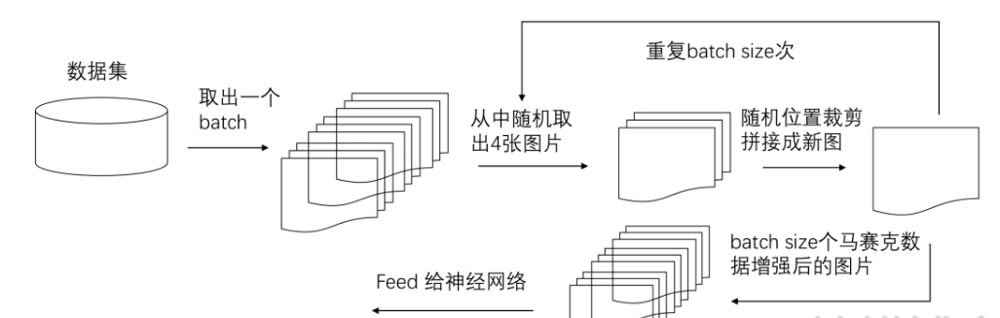
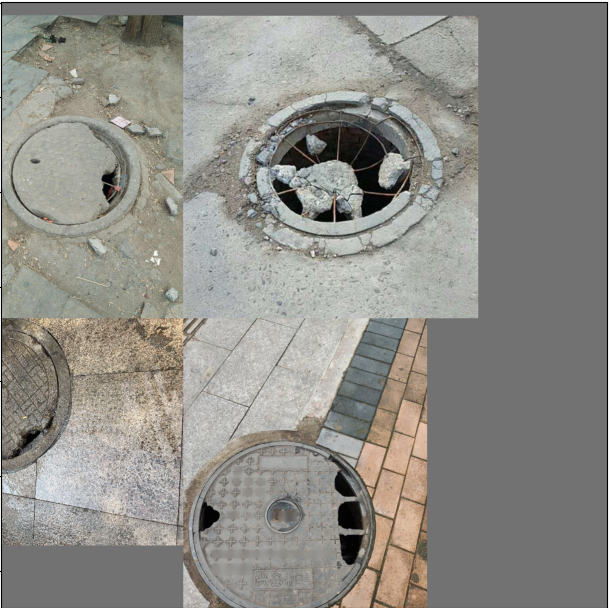

# Text

井盖智能检测系统

# 技术概括

本团队的技术模块，主要分为数据增强和网络识别两部分，前者包括数据搜集与数据增强两个子模块，后者为可供选择的yolov8和FasterRcnn目标检测网络，它们分别具有检测速度快和相对准确率高的优点。

## 数据获取

### 数据搜集

人井管道数量庞大、分布广泛、形态各异，对井盖的隐患处理工作十分重要。各类资源隐患管理稽核工作单一重复，且工作量大，正适合用AI作业代替人工作业盖；但是，引入AI会遇到实际场景复杂、隐患识别难度大、类别难区分等一系列问题。考虑到训练集样本数量不平衡，井圈问题相关样本数量较少，且图片的环境单一，图片的质量较低，需要大量的井盖图片数据样本，因此我们首先采用了多种数据搜集方法扩充数据量，让模型学习所有情况下的井盖图片，增强模型的泛化能力。

#### 爬虫技术

爬虫技术是一种通过编写程序自动获取网页数据的技术。爬虫程序会模拟人类在浏览器中访问网页的行为，发送HTTP请求获取网页内容，然后解析网页内容提取所需的信息。这种技术可以帮助用户快速、高效地获取互联网上的各种数据，如文本、图片、视频等。爬虫技术为数据获取带来大量优势：

1. **数据获取效率高**：爬虫程序可以自动化、快速地访问网页并提取数据，比人工手动复制粘贴效率更高。
2. **数据量大**：爬虫技术可以处理大规模的数据，收集大量的井盖图片实现数据集的扩充。
3. **数据更新及时**：定时运行爬虫程序，可以实现数据的自动更新。
4. **数据多样性**：爬虫技术可以获取各种情况的井盖图片，且图片质量不一，可以有效应对现实中的复杂环境，满足不同需求的数据采集。
5. **提高工作效率**：爬虫技术可以节省大量时间和人力成本。
6. **信息聚合**：爬虫技术可以帮助我们从不同来源的网站中收集井盖图片，实现信息的聚合和整合。

爬虫技术在数据获取和处理方面具有高效、灵活、自动化等优势，可以帮助我们更好地利用网络上的数据资源，提高工作效率和数据分析能力。我们团队选择使用Python语言的爬虫技术，这得益于Python在数据处理和分析方面的出色表现，我们选择Scrapy的爬虫框架，Scrapy使用了 Twisted异步网络库来处理网络通讯，可以加快下载的速度，不用自己去实现异步框架，为爬虫技术的实现提供了许多便利。

#### 数据清洗

模型的训练数据质量对模型性能有很大影响，从网络上爬虫获得的图像数据存在图片相似与相同、图像质量低，图像模糊、图片缺少对应目标等问题。我们团队希望通过数据清洗：

1. **提高模型性能**：通过去除错误标记、重复数据和噪声数据，可以提高模型的准确性和泛化能力。
2. **减少过拟合**：清洗数据可以减少模型对噪声的敏感性，有助于减少过拟合的风险。
3. **加快训练速度**：清洗后的数据集更加干净，可以加快模型的训练速度，节省时间和计算资源。
4. **提高模型稳定性**：数据清洗可以使数据集更加一致和稳定，有助于模型在不同数据分布下的表现。

我们团队使用卷积神经网络（CNN）深度学习模型对图像进行回归，判断图像是否包含对应目标。在筛选去重方面我们采用基于深度学习模型（VGG）图像检索的方式获得图像特征向量，然后计算特征向量的cosine距离。设置较大的阈值，将较为冗余的图像筛选去掉。在去除模糊图像方面我们选用opencv库并利用拉普拉斯算子计算图片的二阶导数，反映图片的边缘信息，同样事物的图片，清晰度高的，相对应的经过拉普拉斯算子滤波后的图片的方差也就越大。

### 数据增强

通过爬虫技术，我们团队搜集到了大量井盖图片样本，但仍然存在某些特定环境下的图片样本数量不足的问题，如强曝光、夜晚昏暗、雨天井盖模糊等复杂环境，且井盖存在类内特征差异大，类间特征相似的问题，需要扩充特定样本的数量来让模型网络学习更多相关特征，所以我们团队希望通过数据增强的方式，生成特定需要的图片样本，同时扩充数据集样本数量，进一步提高模型的能力。我们将这一任务分为有监督数据增强和无监督数据增强两个子模块，在有监督数据增强模块部分，我们期望通过对原始图片进行一系列变换达到扩充数据集的目的；在无监督数据增强模块部分，我们期望通过生成网络补充特定类的样本数量，解决样本数量不平衡问题。

#### 有监督数据增强

有监督数据增强是指在训练深度学习模型前，通过对原始数据进行一系列变换和扩充，生成新的训练样本，从而增加训练数据的多样性和数量。有监督数据增强的作用和优势：

1. **提升模型泛化能力**：通过引入更多的数据变化，可以使模型更好地适应不同的数据分布，提高泛化能力。
2. **减少过拟合**：数据增强可以有效减少模型的过拟合现象，使模型更加稳健，提高其在未见数据上的表现。
3. **增加数据多样性**：通过对数据进行变换和扩充，可以生成更多样的数据样本，有助于模型学习到更丰富的特征。
4. **增加模型鲁棒性**：通过引入不同的数据变换，可以增加模型对于噪声和干扰的鲁棒性，提高模型的稳健性。

我们使用了裁减、对称、旋转、缩放、增加噪声、改变色调、遮挡、模糊、Mosaic数据增强方式，在模型训练中取得了良好的效果。其中Mosaic数据增强方法是将四张图片进行随机裁剪，在新的训练样本中随机选择一个位置，作为这4张图像的拼接中心点，再拼接到一张图上作为训练数据。这样做的好处是丰富了图片的背景，提供了更多的输入信息和多样性，有助于模型学习到更全面的特征，可以模拟真实场景中多个目标同时出现的情况，提高模型的鲁棒性和泛化能力，有效地扩充了训练数据，减少了过拟合的风险。

#### 无监督数据增强

相对于有监督的数据增强方法，无监督的数据增强是**更高级**的方法。经过数据搜集和数据增强后，样本数量存在不平衡问题，井圈问题相关样本数量较少，我们团队选择使用生成对抗网络（GAN）通过模型学习数据的分布，随机生成与训练数据集分布一致的图片。生成对抗网络由生成器和判别器组成，生成器通过机器生成数据，判别器判断图像是真实的还是机器生成的。在训练过程中，生成网络G的目标就是尽量生成真实的图片去欺骗判别网络D。而D的目标就是尽量把G生成的图片和真实的图片分别开来。这样，G和D构成了一个动态的“博弈过程”。

Goodfellow从理论上证明了该算法的收敛性，以及在模型收敛时，生成数据具有和真实数据相同的分布（保证了模型效果）。GAN模型的目标函数如下：公式中x表示真实图片，z表示输入G网络的噪声，G(z)表示G网络生成的图片，D(·)表示D网络判断图片是否真实的概率。在这里，训练判别器D使得最大概率地分辩训练样本的标签（最大化log D(x)和log(1 – D(G(z)))），训练网络G最小化log(1 – D(G(z)))，即最大化判别器D的损失

## 目标检测

目标检测是计算机视觉领域中的一个重要问题，旨在识别图像或视频中的物体，并确定它们的位置。目标检测任务通常需要在图像中定位并识别多个不同类别的目标，例如行人、汽车、动物等。目标检测问题通常可以分为以下几个方面：目标定位：确定图像中目标的位置，通常使用边界框来表示目标的位置；目标分类：识别图像中目标的类别，即确定目标属于哪一类；目标检测精度：评估目标检测算法的性能，通常使用准确率、召回率、F1分数等指标来评估算法的性能。在这一井盖识别问题中，我们的目标是识别出井盖的位置并对井盖的状态进行分类。

### 传统目标检测

在深度学习出现之前，传统的目标检测方法大概分为区域选择、特征提取、分类器三个部分，即首先在给定的图像上选择一些候选的区域，然后对这些区域提取特征，最后使用训练的分类器进行分类。传统目标选择使用启发式方法或技术生成对整幅图像进行遍历生成候选区域，再使用方向梯度直方图(HOG)、尺度不变特征转换(SIFT)等方法对每个候选区域提取描述候选区域的特征，最后使用支持向量机(SVM)、随机森林等分类器对提取的特征进行目标分类。但是传统目标检测存在许多缺陷：区域选择过程繁琐，可能导致漏检或误检；依赖于手工设计分类器，分类性能有限；手工设计特征限制了对复杂目标的表达能力；且难以处理复杂场景和多目标类别，泛化性能有限。

### 基于深度学习的目标检测

基于手工提取特征的传统目标检测算法进展缓慢，性能低下。直到2012年卷积神经网络(Convolutional Neural Networks, CNNs)的兴起将目标检测领域推向了新的台阶。基于CNNs的目标检测算法主要有两条技术发展路线：Anchor-Based和Anchor-Free方法，其区别是是否使用Anchor进行训练和预测；Anchor-based方法则包括一阶段和二阶段检测算法，二阶段目标检测算法一般比一阶段精度要高，但一阶段检测算法速度会更快，Anchor-Free算法近几年逐步完善。一阶段检测算法（如YOLO、SSD）是一种端到端的检测算法，通过单个神经网络模型直接预测图像中的目标位置和类别。它们通常具有较快的推理速度，适用于实时应用。二阶段检测算法（如Faster R-CNN、Mask R-CNN）则分为两个阶段：首先生成候选区域（region proposal），然后对这些候选区域进行目标分类和定位。这种方法通常具有更高的检测精度，但推理速度较慢。我们在智能井盖识别系统中选用Yolov8的单阶段目标检测算法，检测速度快，可以满足用户的即时性要求。

#### YOLO算法

YOLO（You Only Look Once）的核心思想是将目标检测任务转化为一个回归问题，利用整张图作为网络的输入，仅仅经过一个神经网络，得到bounding box（边界框） 的位置及其所属的类别。通过单个神经网络直接在整个图像上进行预测，实现端到端的目标检测。YOLO是一种单阶段目标检测算法，将目标检测任务简化为一个单一的神经网络模型，它一次性对整个图像进行处理，而不是在不同的区域进行多次检测。这种全图像预测的方式使得YOLO在速度上有较大优势，可以实时进行目标检测。

##### YOLOv1

在YOLOv1提出之前，R-CNN系列算法在目标检测领域独占鳌头。R-CNN系列检测精度高，但是由于其网络结构是双阶段（two-stage）的特点，使得它的检测速度不能满足实时性。为了打破这一僵局，Joseph Redmon等人提出了一种单阶段的目标检测网络，将其命名为：You Only Look Once。YOLOv1将一张图片平均分成S×S个网格单元，并在每个网格单元内预测边界框和类别信息，每个边界框由5个值组成：$ (x, y, w, h, confidence)$,每个网格还会预测 C个条件类别概率值，它表示当有目标的中心位置“落入”该网格中时，这一目标属于C个类别的概率分布。模型最终输出`S*S*(B*5+C)`大小的tensor。

##### YOLOv3

从YOLOv1到YOLOv3每一代的backbone都不断优化。YOLOv3的特征提取网络采用darknet-53网络结构，代替YOLOv2的darknet-qo，利用特征金字塔网络结构实现了多尺度检测，分类方法用逻辑回归代替了softmax，在兼具实用性的同时保证目标检测的准确性。不同于Darknet-19的是，Darknet-53引入了大量的残差结构，并且使用步长为2，卷积核大小为3×3卷积层Conv2D代替池化层Maxpooling2D。通过在ImageNet上的分类表现，Darknet-53经过以上改造在保证准确率的同时极大地提升了网络的运行速度，证明了Darknet-53在特征提取能力上的有效性。

##### YOLOv5

YOLOv5采用了更深的网络、更先进的Backbone网络、FPN结构和PANet结构等，提高了模型对目标的表示能力和特征提取能力。在输入端，YOLOv5引入Mosaic数据增强，随机使用四张图片进行缩放和拼接，增强了模型在低mini batch下的模型表现；在backbone部分，YOLOv5引入了Focus结构和CSP1_X结构，Focus结构主要通过将输入的特征图分为不同的子区域，然后对每个子区域进行卷积操作，最后将所有子区域的特征图合并起来，从而实现特征提取,CSP1_X结构借鉴CSPNet，其全称是Cross Stage Paritial Network，其先将基础层的特征映射划分为两部分，然后通过跨阶段层次结构将它们合并，在减少了计算量的同时可以保证准确率；在Neck部分YOLO引入了CSP2_X结构，加强网络特征融合能力；在Head部分，采用SoftNMS代替传统非极大值抑制(NMS)算法，减少框的丢失，提高了检测结果的准确性，增强了模型的鲁棒性。

##### YOLOv8

YOLOv8·是全新版本的YOLO算法，引入了更多的数据增强技术和训练策略使得模型在各种复杂环境下都能表现良好，相对于前面的版本在性能、模型结构、泛化能力、训练策略和实现方面都具有明显的优势。YOLOv8在网络结构上进行了许多创新，既保证了模型作为单阶段目标检测网络的快速，有提高了模型在各类数据集上的准确率，提高了YOLO检测小物体时的定位精度。

YOLOv8骨干网络和 Neck 部分参考了 YOLOv7 ELAN 设计思想，将 YOLOv5 的 C3 结构换成了梯度流更丰富的 C2f 结构，并对不同尺度模型调整了不同的通道数，属于对模型结构精心微调，大幅提升了模型性能;Head 部分相比 YOLOv5 改动较大，换成了目前主流的解耦头结构，将分类和检测头分离，同时也从 Anchor-Based 换成了 Anchor-Free;Loss 计算方面采用了 TaskAlignedAssigner 正样本分配策略，并引入了 Distribution Focal Loss。训练的数据增强部分引入了 YOLOX 中的最后 10 epoch 关闭 Mosiac 增强的操作，可以有效地提升精度。

###### backbone

yolov8 在backbone部分将c3模块改进为C2f(CSPDarknet53 to 2-stage FPN)模块。C3模块将三个卷积层的输出在通道维度上进行拼接，以获得更加丰富和复杂的特征表示，C3模块的引入可以增加网络的非线性和表达能力，有助于提高目标检测的准确性和泛化能力。CSPDarknet53是一种轻量级的网络结构，结合了Cross Stage Partial连接（CSP）和Darknet53的特点。CSPDarknet53在YOLOv8中作为主干网络，具有更好的特征提取能力和更高的效率。CSPDarknet53通过减少参数数量和计算量的同时，保持了良好的特征表达能力，有助于提高目标检测的性能和速度。2-stage FPN是一种特征金字塔网络（Feature Pyramid Network），用于提取多尺度的特征并改善目标检测的准确性。在YOLOv8中引入2-stage FPN结构可以帮助网络更好地理解不同尺度上的目标信息，从而提高目标检测的鲁棒性和准确性。2-stage FPN可以有效地解决目标在不同尺度下的定位和检测问题，提升了目标检测的性能。

同时spp模块改进为sppf模块，通过在不同层级的特征金字塔上应用SPPF模块，可以获取不同尺度和语义层次的特征信息。这样可以更好地捕捉目标在不同尺度下的特征，提高了检测网络对小目标和远距离目标的识别能力。将简单的并行max pooling改为串行+并行的方式，实现特征的多尺度融合，将不同层级的特征进行有效地融合，提高了网络对目标的定位和分类准确性。这种特征融合的方式有助于减少信息丢失，提高了目标检测的鲁棒性和泛化能力。

###### neck和head:

Head 部分相比 YOLOv5 改动较大，换成了目前主流的解耦头结构，将分类和检测头分离，同时也从 Anchor-Based 换成了 Anchor-Free。解耦头结构将检测网络的输出分成两个部分：分类网络和回归网络，分类网络负责预测目标的类别，回归网络负责预测目标的位置和尺寸，这种解耦的方式可以提高模型的灵活性和稳定性，并且可以根据需要对每个子任务进行针对性优化，使模型更好地适应不同的应用场景和目标类别，使目标检测算法更加灵活和稳定。YOLOv8引入Anchor-free，与传统的Anchor-based方法不同，Anchor-free方法不需要预定义的Anchor boxes来进行目标检测。Anchor boxes是一种用于定义目标位置和尺度的辅助框架，通常在Anchor-based方法中用于预测目标的位置和尺度。Anchor-free方法通过直接回归目标的位置和尺度，而不依赖于预定义的Anchor boxes。Anchor-free方法的优势在于：可以更灵活地适应不同尺度和长宽比的目标，提高了目标检测的泛化能力。

###### 损失函数

YOLOv8的损失函数计算包括两个分支：分类和回归分支。分类分支YOLOv8采用VFL loss，回归损失使用DFL loss和CIOU loss。Varifocal Loss 是为了解决传统交叉熵损失函数在目标检测任务中存在的问题，如正负样本不平衡、难易样本权重不均等。Varifocal Loss 引入了一个衰减系数，用于调整正负样本的损失权重，使得难以分类的样本在损失函数中占据更大的比重，从而提高目标检测器对困难样本的学习能力。DFL Loss 是一种基于 Focal Loss 的改进版本，旨在解决目标检测中的类别不平衡问题。DFL Loss 引入了类别分布信息，通过考虑每个类别的分布情况来调整损失函数，使得在训练过程中更加关注少数类别，从而提高目标检测器的性能。CIOU Loss 是一种用于目标检测中的边界框回归任务的损失函数，旨在优化目标检测器的边界框预测性能。CIOU Loss 基于 IoU（Intersection over Union）指标，考虑了边界框的中心点、宽度和高度的差异，能够更准确地衡量两个边界框之间的相似度。

p 表示目标的存在性概率（objectness score），q 表示目标的分类概率，α是一个平衡参数，γ是一个衰减系数，用于调整正负样本的损失权重。
$$
DFL(p)=-\frac{1}{N}\sum^N_{i=1}\sum^C_{j=1}t_{ij}\alpha_j(1-p_{ij})^\gamma\log(p_{ij})
$$
$p_{ij}$表示第 i 个样本中第 j 类别的预测概率$t_{ij}$ 表示第 i 个样本中第 j 类别的真实标签，C 表示类别数，$α_j $​是一个类别权重，γ 是一个调节参数
$$
CIOULoss=1-IoU+\frac{d^2}{c^2}+av
$$
IoU 表示两个边界框的交并比，d 表示两个边界框中心点之间的距离，c 表示两个边界框的对角线长度之和，v 表示边界框的长宽比差异，α是一个平衡参数

###### 面向小目标检测的网络创新与改进

YOLOv8算法虽然在速度和性能上有所改进，但仍然存在一些问题，相当于二阶段的目标检测算法其精度仍有一定差距，且在小目标检测和遮挡目标检测方面表现不佳。YOLOv8 在预测目标边界框时，存在边界框位置不准确的问题，可能导致目标检测结果不够精准，尤其是对于小目标或者密集目标的检测效果较差，且小目标检测易受图像背景及噪声干扰，分类与定位损失不易计算。我们在实际现实落地应用中，如无人机高空检测井盖会存在大量小目标检测，这会导致模型部署应用效果较差。所以我们团队面向小目标检测对网络进行了创新与改进。

在backbone部分添加可变形卷积模块。可变形卷积是指卷积核在每一个元素上额外**增加了一个参数方向参数**，这样卷积核就能在训练过程中扩展到很大的范围。可变形卷积单元中增加的偏移量是网络结构的一部分，通过另外一个平行的标准卷积单元计算得到，进而也可以通过梯度反向传播进行端到端的学习。加上该偏移量的学习之后，可变形卷积核的大小和位置可以根据当前需要识别的图像内容进行动态调整，其直观效果就是不同位置的卷积核采样点位置会根据图像内容发生自适应的变化，从而适应不同物体的形状、大小等几何形变。添加的可变形卷积模块能灵活处理小目标对应检测点感受野不足的问题，加强对小目标的关注，使得漏检误检的情况得到有效改善，提升检测精度。

（a）是传统的标准卷积核，尺寸为3x3（图中绿色的点）（b）是可变形卷积（c）和（d）是可变形卷积的特殊形式。

#### FasterR-CNN

单阶段的目标检测算法已经在井盖识别上具有较好的表现，其突出优势在于极快的检测速度，但其存在的缺陷是无法在准确率上有更大的突破与提升，在许多的应用场景中，我们无需追求较快的检测速度，更重要的是较高的准确率，所以我们团队又引入了双阶段的目标检测算法，对Faster-RCNN算法作出创新与改进，其获得了更高的准确率表现。

双阶段的目标检测算法，“双阶段”又称基于候选区域（Region proposal）的目标检测。其相对于YOLO等单阶段目标检测算法最大的不同是将目标检测分为两个阶段：第一个阶段先获取输入图像，提取候选区域；第二个阶段再对候选区域进行分类识别。通过增加第一阶段目标与背景的分离提取，使得对目标的定位与识别更加精确和准确，双阶段的算法能同时进行目标检测、分类和定位等多个任务的学习，从而更好地利用数据和提升模型性能。

##### R-CNN

在R-CNN之前，目标检测通常基于手工设计的特征和传统的机器学习算法，如SVM（支持向量机）和随机森林。这些方法在复杂的场景中往往无法提供准确的检测结果。RCNN通过引入深度学习的卷积神经网络（CNN），利用其强大的特征学习能力，极大地改进了目标检测的准确性和性能。RCNN的核心思想是将目标检测问题转化为一系列的候选区域（region proposal）的分类问题。

RCNN第一步需要获取目标区域，它改变了传统分割区域的方法，传统分割区域的方法一为穷举法，遍历图像的每一个像素；二为使用分割算法，预测前景分割区域是一个完整对象区域的可能性大小。它使用选择性搜索，产生图像初始区域后使用贪心算法对区域进行迭代分组，组合两个最相似的区域。第二步对候选区域使用深度网络提取特征，将候选区域缩放到统一大小。第三步使用SVM分类器进行区域类别的判定。最后使用边界框回归预测每个已识别区域的边界框。

##### FastR-CNN

R-CNN的训练分多步，针对每个类别都要训练一个SVM分类其，最后还要对每个类别进行边框预测，步骤比较繁琐，且时间和内存消耗较大。空间金字塔层池化网络（Spatial pyramid pooling networks,SSPnets）可以通过计算共享来加速R-CNN，SSPnet是先对整张图片做卷积，由于卷积池化之后得到的特征图与原图片的特征位置是相对应的，所以直接在特征图上截取候选框，然后再使用做不同尺寸的最大池化将得到的特征向量拼接得到最终的特征向量。因此Fast R-CNN作为RCNN的改进版本，FastRCNN结合了RCNN和SSPnet的优势，针对RCNN出现的问题作出了改进，流程更为紧凑，大幅提升了目标检测的速度和准确度。

Fast R-CNN 将 整张图像 和 一组建议框(object proposals) 作为输入，通过几个卷积层和最大池化层处理整张图像，得到 卷积特征图(conv feature map) ；然后，对于每一个建议框， 通过提出的 RoI pooling layer(感兴趣的区域 (Region of Interest)) 从卷积特征图中利用提取 固定长度的特征,每个特征向量输入到一系列的 全连接层(FCs) 中，最后通过两个同级的输出：softmax 和 bbox regressor :分别对应 K个对象的类别(object classes) 概率 和 K个对象边界框(bounding-box)的 位置 ( 包含四个实数 ) 。

其中引入了RoI pooling layer,使用MaxPooling将任何有效感兴趣区域内的特征转换为具有固定空间范围的小特征图，这提供了一种有效的方法来对RoI内的特征进行下采样，从而保留了重要的信息同时减少了计算量。通过Roi pooling，可以将不同大小的RoI对应的特征图映射到相同大小的输出上，这样可以方便分类和回归。Roi pooling层在Faster R-CNN等目标检测算法中起到了至关重要的作用，使得网络可以有效地处理不同大小的RoI，从而提高了检测性能和效率。

##### FasterR-CNN

FastR-CNN在目标检测领域取得了重大进展，但仍存在一些不足之处，比如引入的ROI池化层处理大量候选区域时会增加整体计算负载，且ROI池化会导致小目标的信息丢失，影响检测的准确性。经过RCNN和FastRCNN的积淀，FasterR-CNN的提出又在检测速度，目标位置检测准确率，分类准确率上得到了进一步的突破。

FastR-CNN在骨干网络首先使卷积层提取图片的特征得到特征图，这其中包含了conv(卷积)，pooling(池化)，relu(激活)三种层。之后FasterR-CNN引入了Region Proposal Networks(RPN)方式生成检测框，传统的检测方法生成检测框十分耗时，比如RCNN使用Selective Search的方法生成检测框。RPN网络实际分为2条线，一条通过softmax分类anchors获得positive和negative分类，一条用于计算对于anchors的bounding box regression(边界框回归)偏移量，以获得精确的proposal。RPN首先为特征图的每个点生成9种anchors(矩阵)作为初始的检测框，在使用softmax初步提取出positive anchors(预测为目标对象)作为候选区域；另一条线使用线性回归模型对检测框的坐标进行坐标回归，最后应用NMS输出候选框。

对于传统的卷积神经网络，当网络训练好后输入的图像尺寸必须是固定值，同时网络输出也是固定大小的矩阵。如果输入图像大小不定，这个问题就变得比较麻烦。有2种解决办法：从图像中裁剪一部分传入网络；将图像放缩成需要的大小后传入网络。FasterR-CNN使用RoI pooling达到这一效果，其先使用参数将候选框映射回特征图的尺度大小，再将候选框对应的特征图分块为需要的大小，对每一块进行池化，最后获得要求的图像尺寸。

最后利用获得的候选框特征图，通过全连接层与softmax计算每一个候选框的类别。

##### 面向小目标检测的网络创新与改进

图像中小目标因为样本分辨率低，携带信息匮乏，特征表达能力较弱，因此小目标检测在训练过程中容易被忽略；且FasterR-CNN使用了最大池化层，导致小目标在最后的特征图上的像素数过少，网络学习到的目标特征不足，影响分类结果，因此对图像中的小目标的检测准确率不高，在井盖智能检测系统实际落地应用中具有较大的局限性，因此我们针对小目标检测对FasterCNN进行了一定的创新与改进。

FasterR-CNN 算法采用的 VGG-16网络包含多次下采样,经迭代后小目标信息丢失或扭曲,因 此小目标检测效果较差;同时,RPN 中锚点尺寸的 设置与目标尺寸不符,导致生成的区域建议框不准 确,影响检测效果。此外,图像存在不同程度噪声, 图像质量低,导致网络学习效果差。针对以上问题,我们团队对FasterR-CNN 进行了如下改进:在训练样本中加入图像的高频 HF(HighFrequency)增强图像,以提高网络的目标定位效率;将特征提取网络更换为特征提取能力更强的深度残差网络,并进一步调整RPN中的锚点规格和纵横比,以适应小目标尺寸。

由于图像细节被噪声干扰,并且待检测目标与图像背景的灰度值差别不大,给下一步的目标识别带来困扰。因此,在目标识别之前首先对图像进行预处理。图像增强的方法一般有空间域变换增强和频率变换增强2种。结合所用数据集的特点,我们选择采用非线性灰度变换增强方法———对数变换增强方法,另外,由于在对比度增强后的样本图像中,被 检测目标与背景之间有较明显的灰度变化,而变化部分对应图像的高频部分,因此在原始图像中增强高频部分,突出目标边界以提高目标在图像中的显著性,这种方法能够有效提高网络的目标定位效率。

ResNet-50网络中的卷积层分为5组,如表所示:网络由1个单独的卷积层(Conv1)和4组模块(Conv2~Conv5)组成,4组模块分别包含3,4,6 和3个卷积核,每个小模块内分别有3个卷积。通过 ResNet结构的跳层链接,可以提高网络的学习能 力,解决因卷积层数增加而产生的梯度消失问题。此外,由于数据集中的待检测目标包含大量小目标,而原始 FasterR-CNN 的 RPN 的锚点尺寸设置较大,不利于小目标检测。为使 FasterRCNN 对小目标更加敏感,我们团队将 RPN 网络中的锚点尺寸(如图2所示)修改为 (32,64,128,256, 512),保持比例不变,从而生成更为准确的区域建议框,提高检测精度。

