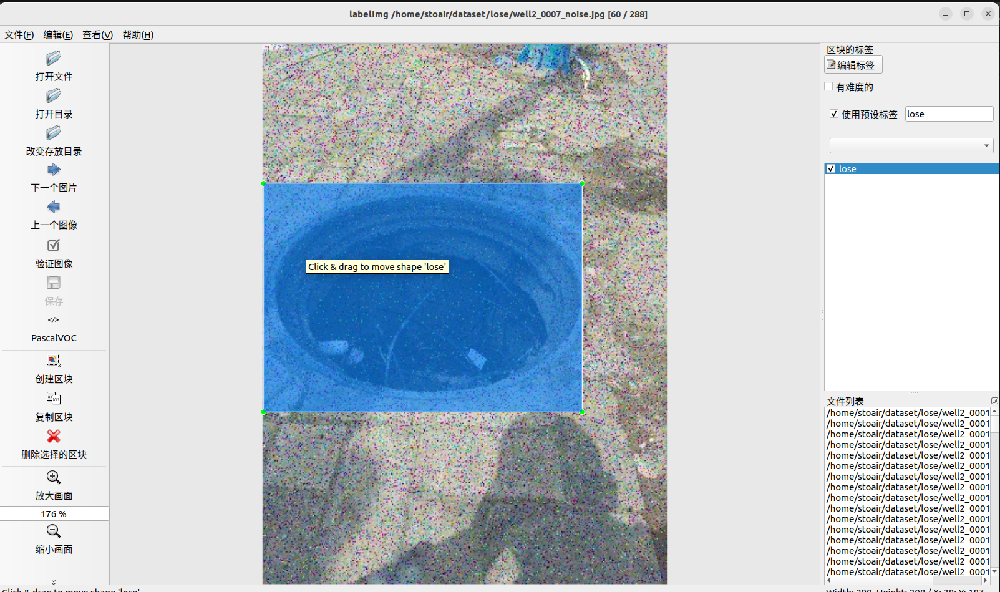
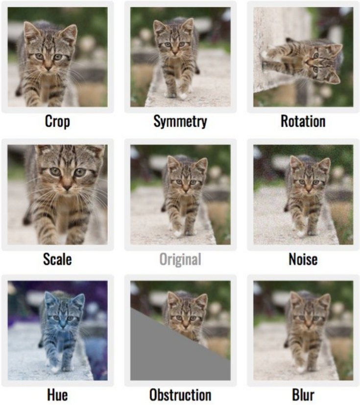
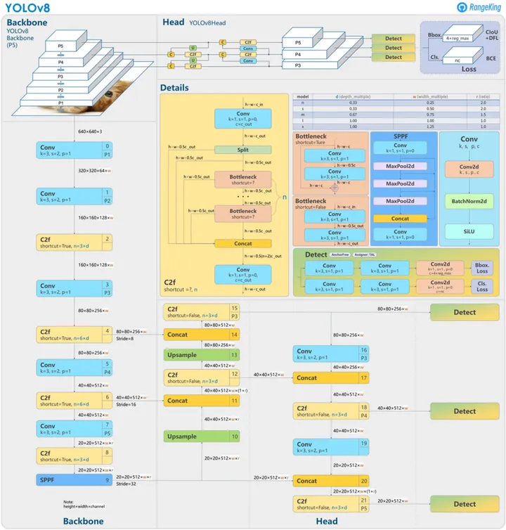
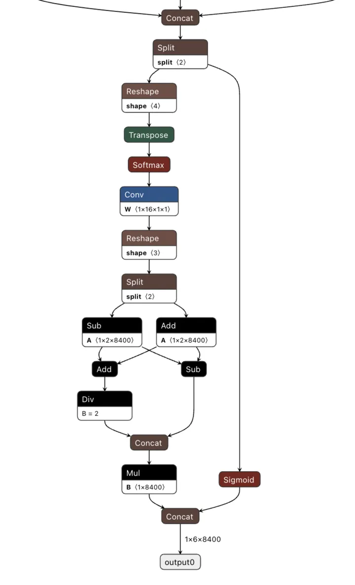
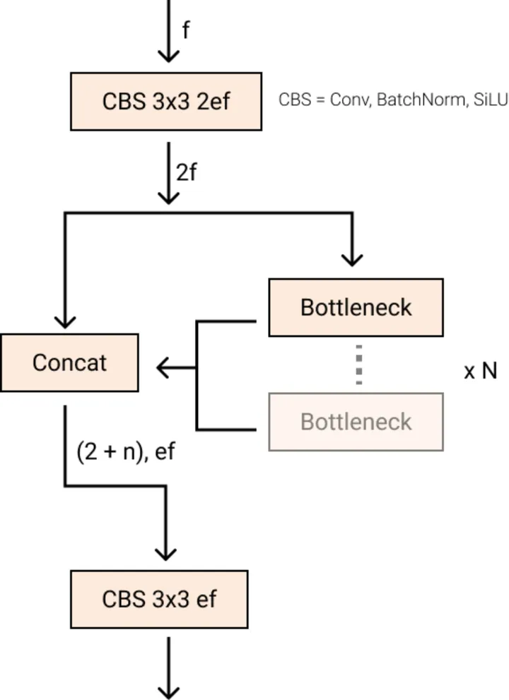

# YOLOv8

制作自己的数据集

## (1).数据增强

- 椒盐噪声，高斯噪声，昏暗，亮度，旋转，翻转，Mosaic数据增强

## (2).数据标注

### labelImg



### xml转txt

已给标签部分转为txt

## (3).划分训练集

数据增强的图片全部扔到训练集，剩下图片再按比例分为train/val

## (4).训练

### 1.命令行

```c++
yolo task=detect mode=train model=yolov8n.pt data=data/fall.yaml batch=32 epochs=100 imgsz=640 workers=16 device=0
```

### 2.py代码

```python
from ultralytics import YOLO
model = YOLO("weights/yolov8n.pt") 
results = model.train(data="data/animal.yaml", epochs=20, batch=8) 
```

### 3.修改配置文件

## (5).不同检测模型


## (6).评估模型

相同IOU阈值下不同置信度分数的模型表现，每一类的mAP

## (7).Results

## (8).Problem

1. 使用各种方法改变预训练权重为yolov8x，仍使用yolov8n训练

- YOLOv8n进行AMP检查。AMP是一种优化训练和推断性能的技术，可以在保持模型精度的同时提高计算效率。在这个过程中，他们通过在开启和关闭AMP的情况下运行推断来验证两者之间的结果差异是否在可接受的范围内。这样可以确保AMP的使用不会对模型的输出产生不可接受的影响。

  不使用用户提供的模型的原因是因为用户提供的模型可能没有经过预训练，或者即使经过预训练，也可能无法在他们用于比较的图像“bus.jpg”中检测到任何目标。这可能是因为模型在不同领域上进行了训练，或者仅仅训练不足，导致无法有效地检测到目标。因此，为了确保检测的准确性和可靠性，他们选择不使用用户提供的模型进行这项测试。

# 数据集问题

## 数据采集

- 实地获取

- 爬虫

- 删除低质量数据

## 数据增强

### 在线数据增强

mosaic数据增强——>最后10个epoch关闭有助提高性能py 2

### 离线数据增强

目标：数据量小，解决过拟合问题，提高模型泛化能力




# YOLO

YOLO 的名气归因于其在保持较小模型尺寸的同时具有相当高的准确性。YOLO 模型可以在单个 GPU 上进行训练，这使得开发人员可以廉价地使用它。机器学习从业者可以以低成本将其部署在边缘硬件或云端。



## 无锚检测

YOLOv8 是一个无锚模型。这意味着它直接预测对象的中心，而不是已知[锚框](https://link.zhihu.com/?target=https%3A//blog.roboflow.com/what-is-an-anchor-box/)的偏移量

[锚框](https://link.zhihu.com/?target=https%3A//blog.roboflow.com/what-is-an-anchor-box/)是早期 YOLO 模型中众所周知的棘手部分，因为它们可能代表目标基准框的分布，但不能代表自定义数据集的分布

无锚点检测减少了盒预测的数量，从而加快了非最大值抑制 （NMS） 的速度，这是一个复杂的后处理步骤，需要在推理后筛选候选检测。



## 卷积

Stem 的第一个 6x6 卷积被 3x3 替换，主要构建块已更改，[C2f](https://link.zhihu.com/?target=https%3A//github.com/ultralytics/ultralytics/blob/dba3f178849692a13f3c43e81572255b1ece7da9/ultralytics/nn/modules.py%3Fref%3Dblog.roboflow.com%23L196) 替换了 [C3](https://link.zhihu.com/?target=https%3A//github.com/ultralytics/yolov5/blob/cdd804d39ff84b413bde36a84006f51769b6043b/models/common.py%3Fref%3Dblog.roboflow.com%23L157) 。该模块总结如下图，其中“f”是特征数，“e”是扩展率，CBS是后面由Conv、BatchNorm和SiLU组成的块。

在 C2f 中，Bottleneck（具有残差连接的两个 3x3 卷积的名称）的所有输出都被连接起来。而在 C3 中，仅使用最后一个Bottleneck 的输出。



## 数据增强

